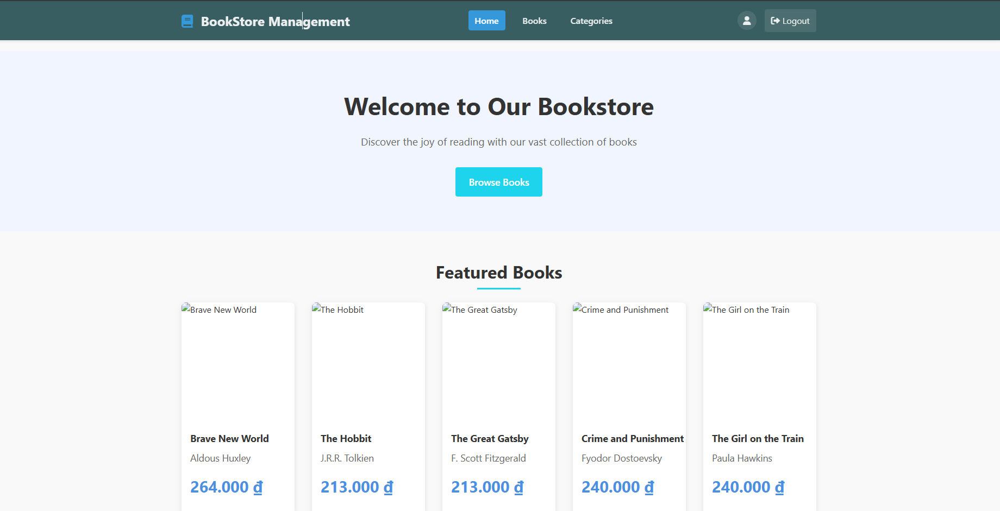
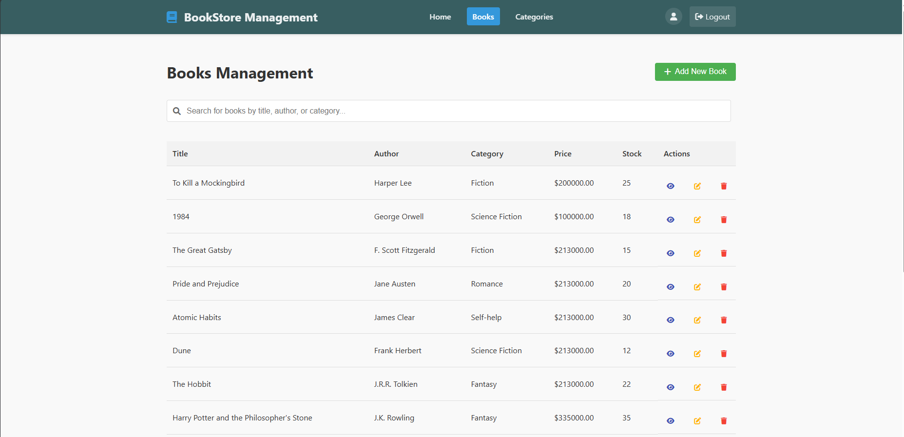
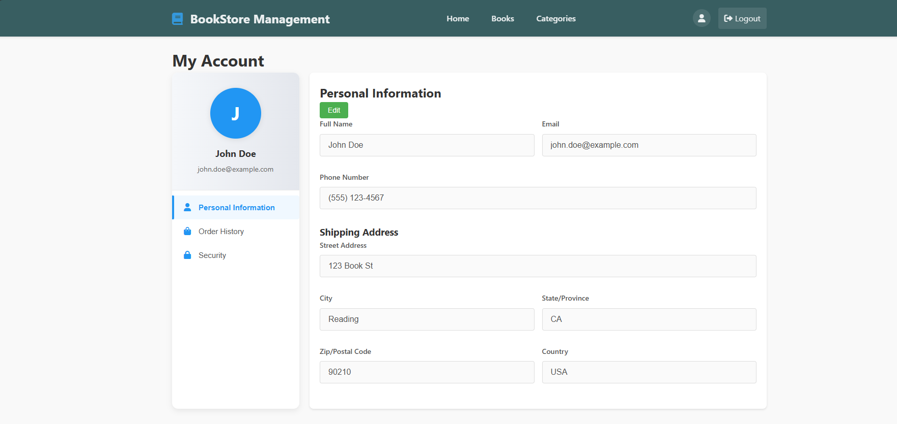
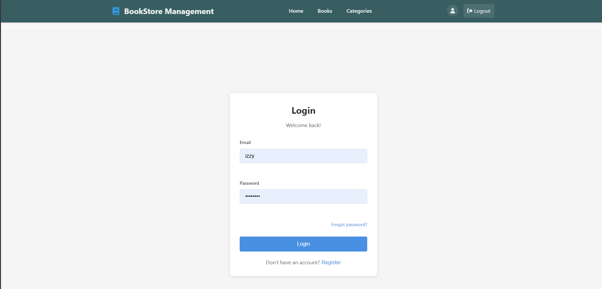

# Quản lý Dự án Phần mềm

## Cấu trúc Repository

- `docs/`: Thư mục chứa tài liệu dự án
- `schedule.md`: Kế hoạch và tiến độ dự án
- `docs/business-requirements.md`: Báo cáo khảo sát hiện trạng và quy trình nghiệp vụ
- `assets/screenshots/`: Thư mục chứa các ảnh chụp màn hình website

## Thành viên nhóm

| STT | Họ và tên | MSSV |
|-----|-----------|------|
| 1 | Nguyễn Quang Hiếu | 3121411071 |
| 2 | Đoàn Minh Khôi | 3121411106 |
| 3 | Trần Minh Chiến | 3121411028 |

## Website cá nhân

- [Đoàn Minh Khôi](https://my-portfolio-git-main-izzys-projects-8588080b.vercel.app/)
- [Nguyễn Quang Hiếu](https://nguynqh.github.io/)
- ...

## Links

- [Project Plan](schedule.md)

## Screenshots

### Giao diện người dùng

